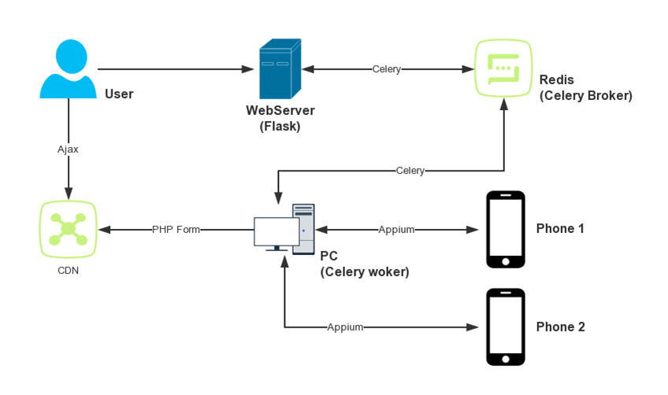
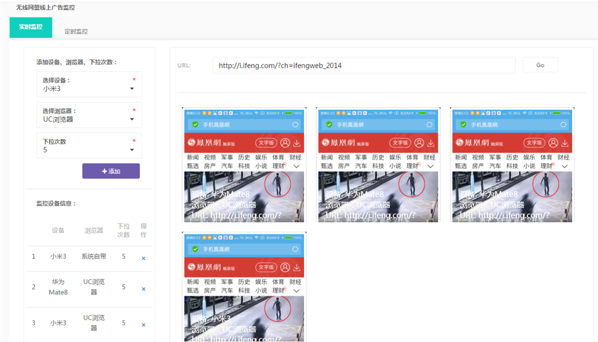
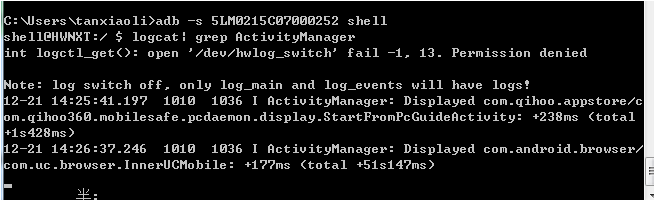
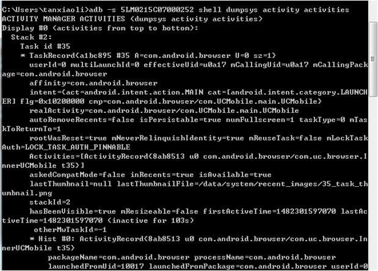
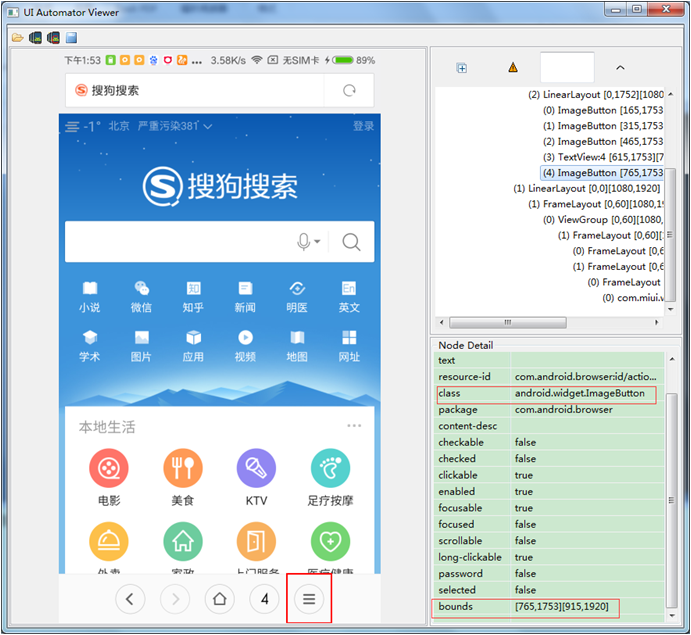

# Appium + Celery实现网页兼容性测试

## 项目背景

&emsp;&emsp;网页兼容性测试往往是日常测试过程中最繁琐的一项，多系统、多终端、多浏览器、多样式广告的兼容性测试，想想都头疼。。。好吧，自动化

---
## 技术栈

- [Flask](http://flask.pocoo.org/) - Python 编写的轻量级 Web 应用框架
- [Appium](http://appium.io/slate/en/master/?python#about-appium) - 移动端的自动化框架
- [Celery](http://docs.jinkan.org/docs/celery/) - Python的分布式任务队列

---
## 项目架构



- 用户通过[Web页面](#homepage)设定任务(设备、浏览器、下拉次数、访问URL)
- WebServer通过Celery实现异步任务发布、调用
- Appium实现测试的执行、结果的收集(截图)
- PHP Form实现截图的上传
- Ajax实现页面自动刷刚上传的截图

---
<span id="homepage">
</span>
## 项目页面


---
## 项目技巧

1.  Appium连接设备时，每个设备都需要打开一个Appium Server，监听不同的端口，可使用命令行打开
    ```
    "C:\Program Files (x86)\Appium\node.exe" "C:\Program Files (x86)\Appium\node_modules\appium\lib\server\main.js" --no-reset --address 127.0.0.1 --port 4723 --bootstrap-port 4724 --platform-name Android --platform-version 23 --automation-name Appium --device-name "f0decf5c" --log-no-color --session-override  --log "C:\Users\tanxiaoli\Desktop\t.log“
    ```

2.  使用Apktool获取apk原始的AndroidManifest.xml
    ```
    apktool d <file.apk> <dir>
    ```

3.  获取当前Activity信息

    * 方法一:
        ```
        adb –s device_id shell  # 进入命令行模式
        logcat | grep ActivityManager
        ```

        

    * 方法二:
        ```
        adb –s device_id shell dumps activity activities
        ```

        

4.  Android中，使用uiautomator view定位元素。若元素无法通过ID/Name定位，可使用坐标法进行定位

    

    ```
    def find_element_by_class_name_and_location(driver, class_name='', location={}):
        """
        通过类名和坐标获取元素
        """
        items = driver.find_elements_by_class_name(class_name)
        try:
            for item in items:
                if str(item.location['x'])[:-2] == location['x'] and str(item.location['y'])[:-2] == location['y']:
                    return item
        except:
            logger.error(traceback.print_exc())
            return None
    ```

5.  Appium API中的flick、swipe、scroll在WebView中无法使用（短点击），需要使用long_press
    ```
    def flick(driver, start_x, start_y, end_x, end_y):
        """
        实现快速滑动，appium元素的flick中使用的是press,无法实现快速滑动
        """
        action = TouchAction(driver)
        action.long_press(x=start_x, y=start_y, duration=50).move_to(x=end_x, y=end_y).release().perform()

    def swipe(driver, start_x, start_y, end_x, end_y, duration=None):
        """
        实现带duration的滑动,appium元素的swipe中使用的是press,无法实现带duration的滑动
        """
        action = TouchAction(driver)
        action.long_press(x=start_x, y=start_y).wait(duration).move_to(x=end_x, y=end_y).release().perform()

    def scroll(driver, start_el, end_el):
        """
        滑动,appium元素的scroll中使用的是press,无法实现滑动
        """
        action = TouchAction(driver)
        action.long_press(el=start_el).move_to(el=end_el).release().perform()
    ```

6.  如果根据application节点中application:name无法打开application，可先打开别的程序，然后切换到测试的application
    ```
    ###############################
    # 此示例为小米手机打开内置浏览器（先打开设置，然后打开内置浏览器）
    # 小米内置浏览器对com.android.browser重写，试了下无法通过com.android.browser.BrowserActivity直接打开
    ###############################

    # --------------------Appium设置-------------------------------
    desired_cap = dict()
    desired_cap['automationName'] = 'appium'  # 自动化测试引擎
    desired_cap['platformName'] = self.conf[self.device]['platformName']  # 操作系统
    desired_cap['platformVersion'] = self.conf[self.device]['platformVersion']  # 系统版本
    desired_cap['deviceName'] = self.conf[self.device]['deviceName']  # 手机类型，android暂不起作用
    desired_cap['udid'] = self.conf[self.device]['deviceName']
    desired_cap['newCommandTimeOut'] = 10  # 命令超时时间
    desired_cap['unicodeKeyboard'] = True  # 不使用键盘，用unicode发送文本
    desired_cap['resetKeyboard'] = True

    desired_cap['appPackage'] = 'com.android.settings'
    desired_cap['appActivity'] = '.Settings'  # 启动的activity

    # 启动后等待的activity
    desired_cap['appWaitActivity'] = 'com.android.settings.MiuiSettings'

    self.driver = webdriver.Remote('http://127.0.0.1:%s/wd/hub' % self.conf[self.device]['listenPort'], desired_cap)
    self.device_window_size = self.driver.get_window_size()

    try:
        # 无法直接打开小米浏览器（默认的方法被弹出的alert阻止），采取间接方法打开
        self.driver.start_activity('com.android.browser', 'BrowserActivity')
        self.driver.switch_to.alert
        self.driver.find_element_by_name('确定').click()
    except:
        pass
    ```

7.  中文输入需要借助adbkeyboard.apk输入法，非中文可直接使用adb输入
    ```
    def input_content_utf8(device, content):
        """
        通过adb向android输入文本
        此方法需要借助ADBKeyboard.apk，可通过adb shell的广告输入中文和英文
        """
        cmd = 'adb -s %s shell ime set com.android.adbkeyboard/.AdbIME 2>&1' % device  # 从ADB切换到ADBKeyBoard
        local_command(cmd)
        time.sleep(1)
        # 当输入字符串过长时，adb shell也无能为力，采取拆分字符串多次输入
        contents = split_str_by_step(content, 60)
        for item in contents:
            cmd = 'adb -s %s shell am broadcast -a ADB_INPUT_TEXT --es msg "%s"' % (device, item)  # 文本输入
            local_command(cmd)
            time.sleep(1)
        cmd = 'adb -s %s shell am broadcast -a ADB_EDITOR_CODE --ei code 2' % device  # 相当于回车
        local_command(cmd)

    def input_content(device, content):
        """
        通过adb向android输入文本
        可通过adb shell的广告输入网址
        """
        # 当输入字符串过长时，adb shell也无能为力，采取拆分字符串多次输入
        contents = split_str_by_step(content, 60)
        for item in contents:
            cmd = 'adb -s %s shell input text "%s" 2>&1' % (device, item)  # 文本输入
            local_command(cmd)
            # time.sleep(1)
        cmd = 'adb -s %s shell input keyevent 66' % device  # 相当于回车
        local_command(cmd)
    ```


